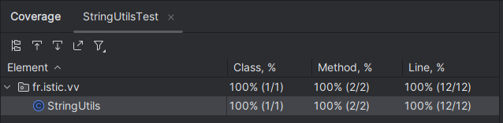
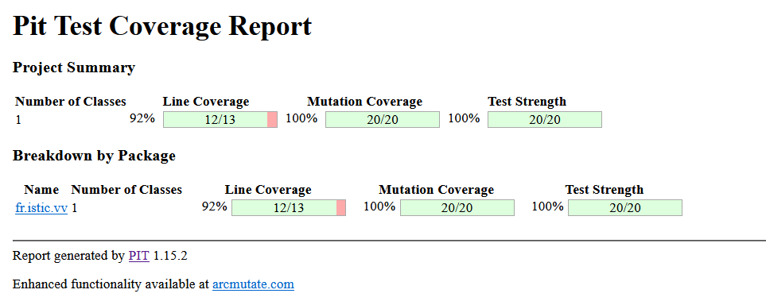

# Balanced strings - Issa Hassan Fadoul & Maxime Le Gal

A string containing grouping symbols `{}[]()` is said to be balanced if every open symbol `{[(` has a matching closed symbol `)]}` and the substrings before, after and between each pair of symbols is also balanced. The empty string is considered as balanced.

For example: `{[][]}({})` is balanced, while `][`, `([)]`, `{`, `{(}{}` are not.

Implement the following method:

```java
public static boolean isBalanced(String str) {
    
}
```

`isBalanced` returns `true` if `str` is balanced according to the rules explained above. Otherwise, it returns `false`.

Use the coverage criteria studied in classes as follows:

1. Use input space partitioning to design an initial set of inputs. Explain below the characteristics and partition blocks you identified.
2. Evaluate the statement coverage of the test cases designed in the previous step. If needed, add new test cases to increase the coverage. Describe below what you did in this step.
3. If you have in your code any predicate that uses more than two boolean operators, check if the test cases written so far satisfy *Base Choice Coverage*. If needed, add new test cases. Describe below how you evaluated the logic coverage and the new test cases you added.
4. Use PIT to evaluate the test suite you have so far. Describe below the mutation score and the live mutants. Add new test cases or refactor the existing ones to achieve a high mutation score.

Write below the actions you took on each step and the results you obtained.
Use the project in [tp3-balanced-strings](../code/tp3-balanced-strings) to complete this exercise.

## Answer

1. caractéristiques des partitions  
- Chaîne Vide :  
Testez avec une chaîne vide.

- Chaînes Équilibrées :  
Testez avec diverses combinaisons de symboles de regroupement correctement appariés et imbriqués.
Incluez des cas où ces symboles de regroupement sont mélangés avec d'autres symboles.

- Chaînes Déséquilibrées :  
Testez avec diverses combinaisons de symboles de regroupement incorrectement appariés ou imbriqués.
Incluez des cas où ces symboles de regroupement sont mélangés avec d'autres symboles.

- Mélange de Symboles :  
Testez avec un mélange de divers symboles, y compris des symboles de regroupement, des symboles arithmétiques et des caractères spéciaux.
Incluez des cas où ces symboles sont correctement ou incorrectement imbriqués.

2. Les cas de tests de l'étape précédente couvrent 100% de la méthode. Nous n'avons donc pas eu besoin de rajouter d'autres tests



4. On teste cette condition pour satisfaire le base choice coverage. 
```java
return (openSymbol == '(' && closeSymbol == ')') ||
        (openSymbol == '[' && closeSymbol == ']') ||
        (openSymbol == '{' && closeSymbol == '}');
```

nous avons rajouté les cas de tests suivants :

```java
@Test
void testBaseChoiceCoverage() {
    // Condition 1 - True
    assertTrue(StringUtils.isMatching('(', ')'));

    // Condition 1 - False
    assertFalse(StringUtils.isMatching('(', ']'));

    // Condition 2 - True
    assertTrue(StringUtils.isMatching('[', ']'));

    // Condition 2 - False
    assertFalse(StringUtils.isMatching('[', '}'));

    // Condition 3 - True
    assertTrue(StringUtils.isMatching('{', '}'));

    // Condition 3 - False
    assertFalse(StringUtils.isMatching('{', ']'));
}
```
pour tester les conditions suivantes :
``` 
Condition 1 : (openSymbol == '(' && closeSymbol == ')')  
Condition 2:  (openSymbol == '[' && closeSymbol == ']')  
Condition 3 : (openSymbol == '{' && closeSymbol == '}')
```

4. Résultat des tests de mutation avec Pitest :



On obtient une couverture de mutation et une force de test 100% avec nos tests initiaux, aucun changement n'est nécessaire. La couverture par ligne n'est pas à 100%, mais la ligne manquante correspond au constructeur vide :


Voici la liste des mutants réalisés par Pitest :


On peut voir notamment qu'à la ligne 14, pitest a essayé d'inverser chaque partie de la condition et qu'à chaque fois un des test a échoué.  
Ensuite ligne 15, Pitest a enlever l'appel à push et qu'un des test a échoué.  
Ligne 19, Pitest a changé `return false` par `return true` et qu'un des test a échoué  
Ligne 31, Pitest a remplacé la condition dans le return par true et false et a chaque fois un test a échoué.
